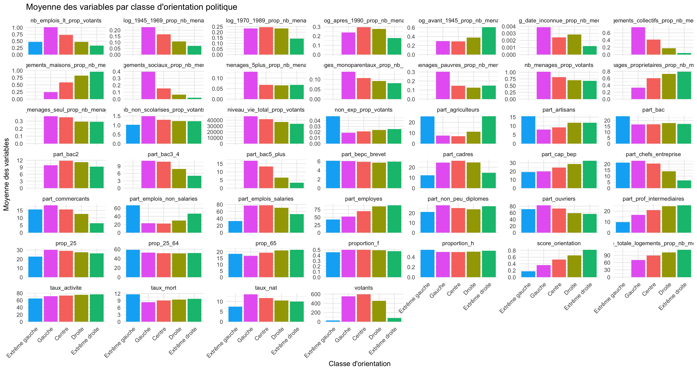

<style>
body {text-align: justify}
</style>

<style>
body {text-align: justify}
</style>

------------------------------------------------------------------------

> **TODO** :\
> - Vérifier qu'il n'y a plus de TODO dans le fichier.\
> - Ajouter des images, diagrammes et extraits de code.\
> - Ajouter des échantillons de données pour expliciter chaque étape.

```{r echo = FALSE, warning = FALSE,  message = FALSE, include=FALSE, results = 'hide'}
library(readr)
library(readxl)
library(gt)
library(dplyr)
library(corrplot)
library(ggplot2)
library(tidyr)
library(caret)
library(ranger)
library(doParallel)
library(nnet)
library(iml)
library(tibble)
library(patchwork)
```

------------------------------------------------------------------------

## Introduction

### Problématique

Prédire les résultats d'éléctions présidentielles française d'un bureau de vote, dans l'idéal. Mais en réalité le but était surtout de trouver des correlations et dépendances entre les résultats d'éléctions présidentielles française d'un bureau de vote, et des données démographiques.

### Cadre théorique

Les préférences politiques des individus peuvent être façonnées par des variables socio-démographiques telles que l’âge, le niveau d’éducation, la situation économique ou encore le lieu de résidence. Nous voulions essayer d'observer des tendances que créent ces cadres théoriques. Plusieurs cadres théoriques permettent de formuler des hypothèses sur ces influences potentielles : 

La **théorie de la socialisation politique** suppose que des facteurs comme l’âge, le genre et la composition familiale jouent un rôle dans la formation des opinions politiques. Par exemple, on pourrait s’attendre à ce que les jeunes adultes soient plus attirés par des idées progressistes, tandis que les générations plus âgées privilégient des positions conservatrices, influencées par leurs expériences passées.

Les théories liées au **clivage de classe sociale**, inspirées par les travaux de Karl Marx et Pierre Bourdieu, postulent que la position des individus dans la hiérarchie socio-professionnelle peut orienter leurs préférences politiques. Les individus occupant des emplois manuels ou précaires pourraient être davantage sensibles aux discours en faveur de la justice sociale, tandis que les catégories socio-professionnelles supérieures seraient plus réceptives aux politiques favorisant l'investissement et la stabilité économique.

Le **capital culturel**, tel que défini par Pierre Bourdieu, pourrait également jouer un rôle dans le comportement électoral. Les niveaux de qualification peuvent influencer la perception des enjeux politiques : les personnes disposant d’un diplôme supérieur pourraient privilégier des valeurs universalistes et libérales, alors que les moins diplômés pourraient être plus sensibles aux discours protectionnistes ou nationalistes.

La **théorie du contexte géographique** met en avant l’importance du lieu de vie et des interactions sociales locales sur les comportements politiques. Les caractéristiques urbaines et rurales, la proportion de logements sociaux ou encore l'ancienneté des constructions peuvent être des indicateurs pertinents pour comprendre les dynamiques électorales locales.

La **théorie de la privation relative** suggère que les inégalités perçues entre les attentes des individus et leur situation réelle peuvent les amener à soutenir des mouvements politiques contestataires. Des indicateurs comme le taux de pauvreté, le niveau de vie ou la précarité de l'emploi pourraient refléter ce sentiment de frustration.

Enfin, la **théorie du choix rationnel** propose que les électeurs adoptent des comportements stratégiques, en cherchant à maximiser leurs bénéfices individuels à travers leurs choix politiques. Par exemple, les propriétaires immobiliers ou les ménages vivant seuls pourraient orienter leurs votes en fonction des politiques perçues comme avantageuses ou défavorables à leurs intérêts.

### Modèle de l’étude

Quel lien existe entre les différents facteurs socio-démographiques et influencent-ils les choix politiques des citoyens ?

### Objectifs de l’étude

L’objectif est d'explorer ces hypothèses théoriques en s'appuyant sur des données socio-démographiques et électorales de plusieurs années. Cette étape théorique permet de poser les bases d’une analyse empirique qui pourra confirmer ou infirmer ces hypothèses en fonction des observations. Nous étudierons les liens au travers de différentes techniques d'analyse statistiques.

------------------------------------------------------------------------

## Identification et récupération des données

### Élections par bureau de vote

D’après le cadre théorique, la première étape consiste à collecter les résultats des élections présidentielles. Pour enrichir notre jeu de données, nous avons choisi de les détailler au niveau des bureaux de vote. La plateforme *data.gouv.fr* nous donne accès à ce type de données. Lors de chaque élection, environ 70 000 bureaux de vote partagent leurs résultats. Nous limiterons toutefois notre étude aux trois dernières élections présidentielles (2012, 2017 et 2022), ce qui sera largement suffisant pour répondre à notre problématique.

De plus, nous nous concentrerons uniquement sur les bureaux de vote situés en France métropolitaine afin de simplifier la visualisation des données sur une carte. Cette restriction n’a qu’un faible impact sur la représentativité globale du jeu de données.

Enfin, nous n'utiliserons que les données des premiers tours. Elles sont plus représentatives du choix de chacun, car non-influencé par l'obligation de voter pour le "moins pire".

### Données socio-démographiques

À partir du cadre théorique, nous avons identifié plusieurs groupes de facteurs socio-démographiques susceptibles d'influencer les orientations politiques des individus :

-   **Facteurs démographique** : ce groupe comprend des variables telles que l’âge, le genre et la composition familiale. Ces éléments permettent d'évaluer l’impact de la socialisation politique, notamment l'influence des générations et des expériences de vie sur le comportement électoral.

-   **Facteurs travail et revenus** : ces variables incluent la catégorie socio-professionnelle, le type d'emploi (salarié ou indépendant), le taux d'activité et le niveau de vie. Elles permettent d'explorer le rôle des disparités économiques et de la hiérarchie sociale sur les préférences politiques, en lien avec la théorie du clivage de classe.

-   **Facteurs éducation** : le niveau de diplôme et les qualifications constituent des indicateurs clés du capital culturel. Ces données sont utiles pour comprendre la manière dont l'accès au savoir et la formation influencent la perception des enjeux politiques.

-   **Facteurs lieu de vie** : ce groupe comprend des variables liées au lieu de résidence, telles que la répartition urbaine ou rurale, la proportion de logements sociaux, et l’ancienneté des constructions. Ces éléments permettent d'examiner l'impact du contexte spatial et des interactions sociales locales sur le vote.

-   **Facteurs conditions de vie** : le taux de pauvreté, la précarité de l’emploi et la composition des ménages permettent de mesurer le sentiment de privation relative et son effet potentiel sur l'adhésion à des mouvements politiques contestataires.

-   **Facteurs mode de vie** : certaines variables, comme la propriété immobilière ou la structure des ménages (par exemple, vivre seul ou en famille), peuvent refléter des comportements électoraux stratégiques, en lien avec des choix rationnels visant à préserver ou à optimiser une situation personnelle.

Certaines de ces données ont été directement récupérées sur le site de l'INSEE, via des études ou des cartes interactives avec export de données (par exemple, statistiques-locales.insee.fr). Nous avons rencontré des difficultés pour obtenir des données complètes et précises, par exemple pour l'âge moyen des habitants. En effet, la donnée était séparée en tranches d'âge, ce qui ne correspondait pas exactement à notre besoin. De plus, ces tranches d'age étaient réduites à moins de 25 ans, 25-64 ans et plus de 65 ans. Nous avons donc dû nous contenter de ces données, en espérant qu'elles soient suffisantes pour notre étude.

Nous avons aussi rencontré des problèmes pour obtenir des données sur le niveau d'études, qui n'étaient pas disponibles pour toutes les années. Pour ces paramètres, nous avons choisi des laisser ces valeurs manquantes plutôt que de les calculer avec des valeurs approximatives. Cela nous permet de conserver une certaine rigueur dans notre analyse, nous laissant toujours la possibilité de revenir sur ce choix et d'imputer les données si besoin.

Les données socio-démographiques concernant les communes d'outre-mer n'ont pas été incluses dans notre étude, car il manquait trop de données pour être comparables avec celles de la France métropolitaine. Cela aurait introduit un biais dans notre analyse, en mélangeant des données provenant de contextes socio-économiques différents.

La grande majorité de ces données étant regroupées par commune, nous avons décidé de les répartir proportionnellement entre les bureaux de vote en fonction du nombre de votants.

Nous avons aussi voulu utiliser d'autres données, ou des jeux plus précis pour notre analyse, mais ces données étaient rapportés aux départements ou région et non par commune. Cela aurait nécessité un travail de fusion et de répartition des données plus complexe, que nous n'avons pas jugé utile pour notre étude.

En revanche, la collecte des données concernant les revenus, le lieu de vie et les conditions de vie a été plus complexe. Ces données sont fournies sous forme de « carreaux » géographiques de 200 mètres de côté. Il a donc été nécessaire de récupérer les contours géographiques des bureaux de vote, de convertir et harmoniser les formats de coordonnées (CRS), puis de fusionner ces ensembles de données. La librairie R sf a été utilisée pour effectuer ces opérations, notamment en croisant les carreaux de 200 mètres avec les contours des bureaux de vote. Cette tâche s'est avérée chronophage en raison du coût élevé des calculs nécessaires pour chaque opération. Certaines données ont dû être additionnées, d'autres moyennées. Une vérification finale a montré une perte de seulement 0,01 % des données, ce qui constitue un excellent résultat pour ce type de fusion géographique.


------------------------------------------------------------------------

## Nettoyage et fusion des données

Concernant le nettoyage des données, plusieurs étapes ont été nécessaires pour garantir la qualité et la cohérence des informations. Les données électorales et socio-démographiques ont été collectées auprès de différentes sources, nécessitant une harmonisation des formats et des variables.
Nous avons d'abord sélectionné les colonnes pertinentes pour notre étude, en éliminant les doublons et les variables inutiles. Un travail de normalisation a été effectué pour uniformiser les noms des colonnes et faciliter les opérations de fusion et de jointure.
Les données ont été vérifiées afin d’éviter les valeurs aberrantes et garantir leur cohérence. Certaines transformations ont également été effectuées pour faciliter la visualisation et les rendre compatibles avec notre modèle d'analyse.

Le point de centralisation des données finales est le **code bureau de vote**, un identifiant unique attribué à chaque bureau de vote.

### Traitement des données électorales

Pour les résultats des élections, il a d'abord été nécessaire de transformer la liste des votes par candidat dans chaque bureau de vote en catégories agrégées correspondant aux principaux courants politiques : Extrême Gauche, Gauche, Centre, Droite et Extrême Droite. Cette étape permet de simplifier l'analyse des tendances politiques tout en conservant une granularité suffisante.

Une colonne "Code" a été ajoutée en combinant les codes du département, de la commune et du bureau de vote, ce qui facilite la fusion avec d'autres jeux de données. Certaines colonnes, telles que les noms des départements ou les pourcentages inutiles (ex. : % Abstentions/Inscrits), ont été supprimées pour alléger le jeu de données. Une colonne "nonExp" a été créée pour regrouper les bulletins blancs et nuls. Cette information nous aide à mieux comprendre les niveaux de participation et de contestation.

Les données finales ont été organisées de manière à regrouper les colonnes liées à chaque courant politique, en mettant en avant les variables principales (comme les pourcentages par votant, inscrits et suffrages exprimés).

Un extrait des données nettoyées et organisées est présenté ci-dessous :

```{r echo = FALSE, warning = FALSE, message = FALSE }

library(readxl)
library(gt)
data <- read_excel("./cleanData/elections/resultats-burvot-t1-presidentielle_2022.xlsx")
head(data, 3) %>%
  gt()

```

### Traitement des données socio-démographiques

Concernant les facteurs socio-démographiques, certaines données étaient déjà disponibles au niveau des bureaux de vote, tandis que d’autres étaient regroupées au niveau communal. Ces dernières ont été réparties entre les bureaux de vote en suivant une répartition proportionnelle basée sur le nombre de votants, comme décrit précédemment. Les données ont ensuite été allégé et les colonnes renommés pour améliorer la lisibilité globale des données. Les colonnes inutiles ont été supprimé, pour éviter de garder des informations superflues.

Afin de préparer la visualisation de nos données sur des cartes, nous avons conservé un fichier spatial au format GeoJSON contenant les contours des bureaux de vote, identifiés par l'ID code_bureau_vote. Ce fichier, d'une taille de 600 Mo, a été isolé pour éviter de ralentir le traitement des données lors des analyses statistiques. En cas de besoin, il peut être facilement fusionné avec notre jeu de données pour générer des visualisations cartographiques.

Ces étapes ont permis de disposer d’un jeu de données homogène et prêt pour l'analyse statistique des corrélations entre les variables socio-démographiques et les résultats électoraux. Voici un échantillon des 72 colonnes finales :

```{r echo = FALSE, warning = FALSE, message = FALSE }

##data <- read_csv("./cleanData/merge_data_all_years.csv", show_col_types = FALSE)
data <- read_csv("./cleanData/merge_data_all_years.csv", show_col_types = FALSE)

data <- data %>%
  filter((voix_eg + voix_g + voix_c + voix_d + voix_ed) != 0)

head(data, 3) %>% 
  gt()
```

------------------------------------------------------------------------

## Visualisation par la carte

Après avoir fusionné toutes les données issues des élections présidentielles de 2012, 2017 et 2022, nous avons construit des cartes géographiques illustrant l'évolution de l'intention de vote des Français au fil du temps. Ces cartes mettent en évidence les changements significatifs dans les orientations politiques de l'électorat, avec une représentation des zones dominées par les votes à droite (teintes bleues) et à gauche (teintes rouges).

En analysant les cartes de 2012, 2017 et 2022, nous pouvons observer un basculement marqué vers la droite dans de nombreuses régions, particulièrement dans le Nord-Est de la France. Toutefois, certaines régions, comme la Bretagne, conservent une stabilité de vote à gauche.

Cette transition dans les résultats électoraux nous invite à explorer plus en détail les facteurs sous-jacents à ces changements, notamment en cherchant des corrélations entre différentes variables socio-économiques et les tendances politiques observées.

Ces dernières sont disponibles directement sur https://helyn.cyrildeschamps.fr, elles sont interactives et des données sont accessibles en cliquant sur la commune de votre choix.

::: {style="display: flex; justify-content: space-between;"}
```{r echo=FALSE, out.width="32%", fig.show='hold'}
knitr::include_graphics(c("France-2012.png", "France-2017.png", "France-2022.png"))
```
:::

------------------------------------------------------------------------

## Data Mining Descriptif

L'analyse des données doit être la plus précise possible. Pour cela, nous avons choisi de créer un jeu de données intermédiaire qui élimine la duplication des bureaux de vote sur plusieurs années. Nous sélectionnerons aléatoirement une seule observation par bureau de vote parmi différentes années afin d’éviter un biais de similitude. En effet, un bureau ayant historiquement voté à droite a de fortes chances de continuer à voter de la même manière, ce qui pourrait fausser l’analyse si nous incluons plusieurs observations temporelles sans ajustement.

Nous ajoutons également une variable score comprise entre 0 et 1, qui indique l’orientation politique moyenne :\
- 0 correspond à l’extrême gauche,\
- 0.5 représente le centre,\
- 1 correspond à l’extrême droite.

```{r}
data <- data %>%
  mutate(
    score_orientation = round(
        (voix_ed * 1 + voix_d * 0.75 + voix_c * 0.5 + voix_g * 0.25 + voix_eg * 0) /
          (voix_eg + voix_g + voix_c + voix_d + voix_ed),
        2
      )
  ) %>%
  filter(!is.na(score_orientation))

score_moyen <- mean(data$score_orientation)

# Intervalle de confiance
n <- length(data$score_orientation)
score_var <- var(data$score_orientation)
alpha <- 0.05
quant_stud <- qt(1-alpha/2, df=n-1)
borne_inf <- score_moyen - quant_stud * sqrt(score_var/n)
borne_sup <- score_moyen + quant_stud * sqrt(score_var/n)
paste(borne_inf, "<", score_moyen, "<", borne_sup)
```

Cela indique que l’orientation politique française actuelle se situe plutôt au centre-droit.

Notre objectif initial est d'explorer la corrélation entre le niveau de richesse et l'orientation politique. Les politiques de droite étant souvent perçues comme plus favorables aux personnes disposant de revenus élevés, il est raisonnable d’anticiper une corrélation positive entre un haut niveau de richesse et un soutien aux partis de droite.

### Recherche de correlation globale

Ensuite, nous avons cherché à analyser les corrélations entre nos données de vote et nos données socio-démographiques. Dans un premier temps, nous avons tenté de relier le nombre de votes aux autres variables. Cependant, nous nous sommes rapidement rendu compte que cette approche introduisait un biais : en utilisant le nombre de votes, nous observions systématiquement une corrélation avec les autres données. Cela s’explique par le fait que l’augmentation de la taille d’une commune entraîne mécaniquement une augmentation du nombre de ménages, d’habitants, et donc du nombre de votes.

Nous avons donc décidé de passer à l’analyse des proportions de voix afin d’éliminer ce biais lié à la taille des communes. En utilisant les proportions de votes exprimées pour chaque catégorie, nous avons pu observer les corrélations entre ces proportions et nos données socio-démographiques. Certaines variables se sont révélées particulièrement significatives, comme la proportion d’employés (part_employé) et celle d’ouvriers (part_ouvrier), qui présentaient des relations notables avec les résultats des votes.

```{r correlation-matrice, echo = FALSE, warning = FALSE, message = FALSE  }
# Colonnes liées aux votes
vote_cols <- c(
  "pourcentage_voix_votant_eg", "pourcentage_voix_votant_g", 
  "pourcentage_voix_votant_c", "pourcentage_voix_votant_d", 
  "pourcentage_voix_votant_ed"
)
vote_cols2 <- c(
  "votants", "non_exp", "voix_eg", "pourcentage_voix_votant_eg", 
  "voix_g", "pourcentage_voix_votant_g", "voix_c", "pourcentage_voix_votant_c", 
  "voix_d", "pourcentage_voix_votant_d", "voix_ed", "pourcentage_voix_votant_ed"
)

# Séparation des colonnes numériques en votes et démographie
df_vote <- data %>% select(any_of(vote_cols))
df_demo <- data %>% select(any_of(setdiff(names(data %>% select_if(is.numeric)), vote_cols2)))

# Calcul des corrélations entre votes et données démographiques
corr_vote_demo <- cor(df_vote, df_demo, use = "pairwise.complete.obs")

# On la transforme en tableau
corr_table <- as.data.frame(as.table(corr_vote_demo))
colnames(corr_table) <- c("VarVote", "VarDemo", "Correlation")

# On trie selon la valeur absolue du coefficient
corr_table_sorted <- corr_table[order(abs(corr_table$Correlation), decreasing = TRUE), ]

# On affiche les 10 plus fortes corrélations
head(corr_table_sorted, 10)

# Tri par variable démographique (group_by) 
corr_table_sorted_by_demo <- corr_table %>%
  group_by(VarDemo) %>%
  arrange(desc(abs(Correlation)), .by_group = TRUE)

# Affiche toutes les corrélations, triées à l'intérieur de chaque VarDemo
corr_table_sorted_by_demo
```
Nous avons également entrepris une analyse ciblée des variables démographiques en regroupant les données par type de variable. Cela nous a permis d’examiner les corrélations spécifiques entre chaque variable démographique et les proportions de votes. Pour ce faire, nous avons trié les corrélations au sein de chaque groupe démographique afin de mettre en évidence les relations les plus fortes et les plus significatives.

À ce stade, nous nous sommes interrogés sur la possibilité de modéliser nos données en utilisant un simple modèle de régression linéaire. L’objectif était de déterminer si une telle approche pouvait capter les tendances observées et expliquer les variations des proportions de voix en fonction des différentes variables socio-démographiques.

### Richesse

N'ayant pas de données sur le niveau de vie en 2012, nous ne séléctionnerons pas de datas sur cette année. Voici le dataset que nous utiliserons:

```{r echo = FALSE, warning = FALSE, message = FALSE }
analys_data <- data %>%
  filter(annees != "2008-2012") %>%
  group_by(code_bureau_vote) %>%
  slice_sample(n = 1) %>%
  ungroup() %>%
  sample_frac(size = 1/7)

head(analys_data, 3) %>% 
  gt()
```

  
Observons rapidement la répartition vote droite/gauche en fonction de la richesse des habitants du secteur du bureau de vote :  

```{r echo = FALSE, warning = FALSE, message = FALSE }
# Installer le package si nécessaire
# install.packages("patchwork")

library(ggplot2)
library(dplyr)
library(patchwork)

lims <- quantile(analys_data$niveau_vie_total, probs = c(0.01, 0.99), na.rm = TRUE)

analys_data_clean <- analys_data %>%
  filter(
    niveau_vie_total >= lims[1],
    niveau_vie_total <= lims[2]
  )

# Diagramme EG
p1 <- ggplot(analys_data_clean, aes(x = pourcentage_voix_votant_eg, y = niveau_vie_total)) +
  geom_point(alpha = 0.7, color = "blue") +
  labs(
    title = "Relation entre Niveau de vie\net % Voix EG",
    x = "Pourcentage de voix votant EG",
    y = "Niveau de vie total"
  ) +
  theme_minimal()

# Diagramme ED
p2 <- ggplot(analys_data_clean, aes(x = pourcentage_voix_votant_ed, y = niveau_vie_total)) +
  geom_point(alpha = 0.7, color = "blue") +
  labs(
    title = "Relation entre Niveau de vie\net % Voix ED",
    x = "Pourcentage de voix votant ED",
    y = "Niveau de vie total"
  ) +
  theme_minimal()

# Affichage côte à côte
p1 + plot_spacer() + p2 + 
  plot_layout(widths = c(1, 0.1, 1)) & theme(plot.margin = margin(10, 10, 10, 10))
```

On constate qu'effectivement le niveau de vie semble impacter le pourcentage de voix d'extrême gauche mais n'explique pas tout. Pour ce qui est de l'extrème droite, on observe une grande répartition donc le niveau de vie ne semble pas un facteur premier. Mais il y a tout de même cette tendance, ce qui laisse penser que la pauvreté pousse à voté dans les extrêmes.

Comparons maintenant avec notre score :

```{r echo = FALSE, warning = FALSE, message = FALSE }

ggplot(analys_data_clean, aes(x = score_orientation, y = niveau_vie_total)) +
  geom_point(alpha = 0.7, color = "blue") +
  scale_x_continuous(
    limits = c(0, 1),                # Force l'axe X entre 0 et 1
    breaks = seq(0, 1, by = 0.1)     # Gradations tous les 0.1
  ) +
  labs(
    title = "Relation entre le niveau de vie et l'orientation de vote",
    x = "Score (0 = Extrême gauche, 1 = Extrême droite)",
    y = "Niveau de vie total"
  ) +
  theme_minimal() +
  theme(
    plot.title = element_text(hjust = 0.5),  # Centre le titre
    text = element_text(size = 12)           # Ajuste la taille du texte
  )
```

Nous cherchons une diagonale allant de l'angle inférieur gauche vers l'angle supérieur droit. Ce n'est pas le cas ici, ce qui indique que l'influence de la richesse sur les votes n'est pas significative lorsqu'elle est observée isolément. En revanche, notre théorie semble se confirmer : plus le niveau de richesse est faible, plus les votes tendent vers les extrêmes.

En conclusion, la richesse permet simplement d'expliquer qu'un niveau de vie bas est associé à une probabilité plus élevée de vote pour les extrêmes.

### Khi-2

Nous avons ensuite tenté de réaliser des tests du Khi-2 afin d’examiner les relations entre nos données catégoriques et les proportions de votes. Pour cela, nous avons décidé de segmenter les données en quatre catégories, représentées par 4 colonnes et 4 lignes, pour simplifier l’analyse et réduire la complexité des relations à tester.

Malheureusement, cette approche s’est avérée encore moins concluante. Les résultats obtenus étaient chaotiques et incohérents, avec des p-valeurs élevées suggérant une absence de relation significative entre les variables étudiées. 

L’un des principaux problèmes rencontrés résidait dans la distribution déséquilibrée des données au sein des catégories. Certaines cellules du tableau de contingence contenaient des effectifs trop faibles, voire nuls, ce qui a réduit considérablement la validité statistique du test du Khi-2. Cela a également généré des résultats peu fiables et difficilement généralisables.

À la lumière de ces difficultés, nous avons conclu que le test du Khi-2 n’était pas adapté à nos données dans leur état actuel. 

### Impact du nombre d'individu

Beaucoup de variable étant des quantités, il est intéressant de plutôt utiliser des proportions. Il faut également supprimer les colonnes inutiles car déjà représenté par d'autres (ex: Taux homme et Nb d'homme).

```{r echo = FALSE, warning = FALSE, message = FALSE}
transform_custom_proportion <- function(df) {
  # Dictionnaire des colonnes avec leurs colonnes de référence pour la division
  reference_map <- list(
    votants = c("non_exp", "nb_non_scolarises", "niveau_vie_total", "nb_menages", "nb_emplois_lt"),
    nb_menages = c("nb_menages_pauvres", "nb_menages_seul", "nb_menages_5plus", "nb_menages_proprietaires", "nb_menages_monoparentaux", "surface_totale_logements", "nb_logements_collectifs", "nb_logements_maisons", "nb_log_avant_1945", "nb_log_1945_1969", "nb_log_1970_1989", "nb_log_apres_1990", "nb_log_date_inconnue", "nb_logements_sociaux"),
    nb_h_total = c("nb_h_15_24", "nb_h_25_64", "nb_h_65"),
    nb_f_total = c("nb_f_15_24", "nb_f_25_64", "nb_f_65")
  )
  
  # Liste des colonnes à supprimer
  cols_to_remove <- c()
  
  # Appliquer les transformations
  for (ref_col in names(reference_map)) {
    target_cols <- reference_map[[ref_col]]
    
    # Vérification : Si la colonne de référence existe et a des valeurs non nulles
    if (ref_col %in% names(df) && any(!is.na(df[[ref_col]]))) {
      for (col in target_cols) {
        if (col %in% names(df)) {
          # Nouveau nom pour la colonne proportionnelle
          new_col_name <- paste0(col, "_prop_", ref_col)
          
          # Créer la nouvelle colonne proportionnelle
          df[[new_col_name]] <- ifelse(df[[ref_col]] > 0, df[[col]] / df[[ref_col]], NA)
          
          # Ajouter l'ancienne colonne à la liste de suppression
          cols_to_remove <- c(cols_to_remove, col)
        }
      }
    }
  }
  
  # Supprimer les colonnes d'origine après transformation
  df <- df[, !(names(df) %in% cols_to_remove)]
  
  # Fonction pour supprimer les valeurs aberrantes avec les percentiles 2% et 98%
  remove_outliers <- function(x) {
    if (is.numeric(x)) {
      lower_bound <- quantile(x, 0.00005, na.rm = TRUE)
      upper_bound <- quantile(x, 0.99995, na.rm = TRUE)
      x[x < lower_bound | x > upper_bound] <- NA
    }
    return(x)
  }
  
  # Appliquer la suppression des valeurs aberrantes sur toutes les colonnes
  df <- as.data.frame(lapply(df, remove_outliers))
  
  return(df)
}

# Appliquer la transformation et suppression sur le dataset "data"
clean_data <- transform_custom_proportion(data)
clean_data <- clean_data %>%
  select(-contains("population_ratio"), -contains("nb_25"), -contains("nb_25_64"), -contains("nb_65"), -contains("population_totale"), -contains("nb_h_total"), -contains("nb_f_total"), -contains("voix_eg"), -contains("voix_g"), -contains("voix_c"), -contains("voix_d"), -contains("voix_ed"), -contains("code_insee"), -contains("libelle"))
```

### Recherche globale par visualisation poussée

Comme évoqué précédemment, il est pertinent de visualiser notre score en fonction de nos différentes variables explicatives. Nous allons donc les tester rapidement et observer les tendances qui en ressortent.

```{r echo = FALSE, warning = FALSE, message = FALSE}
# Ajouter une colonne catégorielle pour regrouper par classe d'orientation politique
clean_data <- clean_data %>%
  mutate(
    orientation_class = case_when(
      score_orientation >= 0 & score_orientation < 0.2 ~ "Extrême gauche",
      score_orientation >= 0.2 & score_orientation < 0.4 ~ "Gauche",
      score_orientation >= 0.4 & score_orientation < 0.6 ~ "Centre",
      score_orientation >= 0.6 & score_orientation < 0.8 ~ "Droite",
      score_orientation >= 0.8 & score_orientation <= 1 ~ "Extrême droite"
    )
  ) %>%
  filter(!is.na(orientation_class))

# Transformer les données au format long pour les barplots
analys_data_long <- clean_data %>%
  select(orientation_class, where(is.numeric)) %>%
  select(-contains("voix")) %>%
  pivot_longer(
    cols = -orientation_class,
    names_to = "variable",
    values_to = "value"
  )

# Calcul des moyennes par classe pour chaque variable
mean_values <- analys_data_long %>%
  group_by(orientation_class, variable) %>%
  summarise(mean_value = mean(value, na.rm = TRUE), .groups = "drop")

# Barplot des moyennes
p <- ggplot(mean_values, aes(x = orientation_class, y = mean_value, fill = orientation_class)) +
  geom_bar(stat = "identity", position = "dodge") +
  facet_wrap(~ variable, scales = "free_y") +
  labs(
    title = "Moyenne des variables par classe d'orientation politique",
    x = "Classe d'orientation",
    y = "Moyenne des variables"
  ) +
  scale_x_discrete(limits = c("Extrême gauche", "Gauche", "Centre", "Droite", "Extrême droite")) +  # Assurer l'ordre sur l'axe des X
  theme_minimal() +
  theme(
    axis.text.x = element_text(angle = 45, hjust = 1),
    legend.position = "none"  # Retirer la légende si elle devient redondante
  )

# Export en image pour une meilleure lecture
ggsave("barplot_matrix.png", plot = p, width = 15, height = 8, dpi = 300)
```

  

Cette matrice de graphiques de dispersion offre un bon aperçu des facteurs qui méritent d'être approfondies. On repère rapidement que le nombre de ménage propriétaire pousse un vote vers la droite. On voit aussi qu'un plus haut niveau d'étude pousse à voter à gauche.

------------------------------------------------------------------------  

## Recherche de corrélations poussées


### Regression liénaire

```{r all-regressions, echo = FALSE, warning = FALSE, message = FALSE}
# Fonction pour générer un graphique avec p-values et R-squared
generate_plot <- function(data, x_var, y_var, x_label, y_label, title) {
  # Modèle de régression
  model <- lm(as.formula(paste0(y_var, " ~ ", x_var)), data = data)
  model_summary <- summary(model)
  
  # Extraction des p-values, R-squared
  coef_pvalue <- signif(model_summary$coefficients[2, 4], 5) # P-value du coefficient
  fstat_pvalue <- signif(pf(
    model_summary$fstatistic[1],
    model_summary$fstatistic[2],
    model_summary$fstatistic[3],
    lower.tail = FALSE
  ), 5) # P-value de la F-statistic
  r_squared <- signif(model_summary$r.squared, 5) # R-squared
  
  # Génération du graphique
  ggplot(data, aes_string(x = x_var, y = y_var)) +
    geom_point() +
    geom_smooth(method = "lm", se = FALSE, color = "red") +
    labs(
      title = title,
      x = x_label,
      y = y_label
    ) +
    annotate(
      "text",
      x = max(data[[x_var]], na.rm = TRUE) * 0.8,
      y = max(data[[y_var]], na.rm = TRUE) * 0.8,
      label = paste0(
        "R² = ", r_squared,
        "\nP-val Coeff = ", coef_pvalue,
        "\nP-val F-Stat = ", fstat_pvalue
      ),
      hjust = 0,
      size = 4,
      color = "blue"
    )
}

# Liste des régressions à effectuer
regressions <- list(
  list(x = "part_employes", y = "pourcentage_voix_votant_eg", x_label = "Part des employés", y_label = "% Voix EG", title = "Régression linéaire : EG ~ part_employes"),
  list(x = "part_employes", y = "pourcentage_voix_votant_c", x_label = "Part des employés", y_label = "% Voix C", title = "Régression linéaire : C ~ part_employes")
  )

# Générer et afficher les graphiques
plots <- lapply(regressions, function(reg) {
  generate_plot(
    data = data,
    x_var = reg$x,
    y_var = reg$y,
    x_label = reg$x_label,
    y_label = reg$y_label,
    title = reg$title
  )
})

# Afficher les graphiques
for (p in plots) print(p)
```

Nous avons donc entrepris de modéliser les relations entre les variables les plus prometteuses à l’aide de régressions linéaires. Dans un premier temps, nous avons effectué des analyses unitaires et observé des résultats plutôt encourageants. Par exemple, la proportion de votes d’un groupe spécifique montrait une forte corrélation avec la part d’employés (part_employé), indiquant un lien significatif entre ces deux variables (schéma ci dessus).

Nous avons ensuite étendu cette approche à d’autres données, notamment celles relatives au travail plus généralement et à l’âge. Cependant, les résultats se sont avérés bien moins concluants. Les modèles de régression linéaire ne parvenaient pas à capturer efficacement les variations des proportions de votes en fonction de ces variables. Nous avons constaté que ces relations semblaient plus complexes et non linéaires, ce qui suggérait que des modèles plus sophistiqués pourraient être nécessaires pour mieux représenter ces interactions.

En outre, l’analyse visuelle des données a révélé une limitation supplémentaire : les points sur les graphiques présentaient une distribution resserrée autour du centre, avec peu de variabilité dans les extrêmes. Cette forme compressée rendait difficile l’identification de tendances claires et limitait la capacité de la régression linéaire à fournir des prédictions robustes.

Face à ces constats, nous avons conclu que la régression linéaire simple, bien qu’utile pour une première exploration, était insuffisante pour modéliser les liens complexes entre les variables socio-démographiques et les proportions de votes. Ces résultats ont souligné la nécessité d’envisager des approches plus avancées, telles que les régressions polynomiales, les modèles non linéaires ou encore des algorithmes d’apprentissage automatique, pour capturer des relations plus subtiles et non linéaires présentes dans les données.

### Régression multiple

En ce qui concerne la régression multiple, nous avons consacré un certain temps pour tester différentes combinaisons de variables afin de trouver des modèles offrant des résultats satisfaisants. Nous avons exploré plusieurs approches, notamment les sélections backward et forward, en essayant différentes configurations et en ajustant les paramètres. Malgré nos efforts, les résultats obtenus n’ont pas été convaincants : aucun modèle ne semblait réellement capable de capturer de manière significative les liens complexes entre les variables démographiques et les proportions de votes.  

### Random forest

#### Entrainement 

Le choix du modèle s'est orienté vers une random forest pour sa capacité à modéliser des interactions complexes entre les variables explicatives. L'implémentation ranger a été retenue en raison de ses performances optimisées, tant en termes de rapidité d'entraînement que de gestion de grandes quantités de données. L'objectif est de détecter des corrélations non linéaires qui pourraient influencer le vote de manière subtile et difficilement perceptible avec des modèles plus simples. Cette approche permet d'obtenir un bon équilibre entre le temps de calcul, la robustesse des prédictions et l'interprétabilité des résultats. Le script détaillé, incluant les paramètres d'entraînement et les étapes de prétraitement, est disponible en annexe pour une analyse complète et reproductible.

```{r eval=FALSE, echo = FALSE, warning = FALSE, message = FALSE}
# Préparation des données
df_model <- clean_data %>%
  group_by(code_bureau_vote) %>%
  slice_sample(n = 1) %>%
  ungroup() %>%
  select(where(is.numeric)) %>%
  select(-contains("voix")) %>%
  filter(!is.na(score_orientation))

write.csv(df_model, file = "big_score_training_data.csv", row.names = FALSE)

nzv <- nearZeroVar(df_model, saveMetrics = TRUE)
df_model <- df_model[, !nzv$nzv]

preProcValues <- preProcess(df_model, method = "medianImpute")
df_model <- predict(preProcValues, df_model)

num_cores <- parallel::detectCores() - 1
cl <- makeCluster(num_cores)
registerDoParallel(cl)

train_ctrl <- trainControl(
  method        = "repeatedcv",
  number        = 5,
  repeats       = 3,
  verboseIter   = FALSE,
  allowParallel = TRUE
)

tune_grid <- expand.grid(
 mtry          = c(2, 4, 6, 8),
 splitrule     = c("variance", "extratrees"),
 min.node.size = c(5, 10, 15)
)

df_model <- as.data.frame(df_model)
X <- df_model[, setdiff(names(df_model), "score_orientation")]
Y <- df_model$score_orientation

set.seed(123)
rf_model <- train(
 x          = X,
 y          = Y,
 method     = "ranger",
 trControl  = train_ctrl,
 tuneGrid   = tune_grid,
 num.trees  = 500,
 importance = "impurity"
)

stopCluster(cl)
saveRDS(rf_model, file = "big_score_model.rds")

rf_model
```

Notre modèle affiche un R-squared de 0.6196, un RMSE de 0.0514 et un MAE de 0.0385, sur 71 013 observations et 43 variables explicatives. Cela signifie que les facteurs socio-démographiques expliquent environ 61 % de la variabilité du vote, ce qui traduit une bonne capacité à identifier des corrélations pertinentes entre les variables et le comportement électoral.

Cependant, cette performance doit être nuancée par la faible variance du score cible, ce qui limite l'amplitude des variations à expliquer. Les erreurs faibles (MAE et RMSE) indiquent une précision notable, mais environ 40 % de la variabilité reste inexpliquée, probablement en raison de facteurs non modélisés, comme des préférences individuelles ou des contextes locaux spécifiques.  

### Etude de la random forest

Nous commençons par identifier les variables significatives de notre modèle en utilisant le score d'importance basé sur l'impureté. Ce score correspond à la somme des réductions d'impureté réalisées par l'ensemble des arbres lorsqu'une variable est utilisée pour diviser un nœud. Bien que cette notion d'impureté puisse nous être peu familière, elle reste un indicateur fiable pour évaluer l'importance des variables. Nous obtenons ainsi :

```{r echo = FALSE, warning = FALSE, message = FALSE}
# Charger le modèle depuis le fichier RDS
rf_model <- readRDS("big_score_model.rds")

# Extraire l'importance des variables
importance_vars <- varImp(rf_model, scale = FALSE)
importance_df <- as.data.frame(importance_vars$importance)
importance_df$variable <- rownames(importance_df)

# Trier par importance décroissante
importance_df <- importance_df[order(-importance_df$Overall), ]

# Choisir un seuil d'importance (exemple : garder les variables dont l'importance est supérieure à 50% du max)
seuil <- 0.50 * max(importance_df$Overall)
selected_vars <- importance_df[importance_df$Overall >= seuil, ]
selected_vars
```

On peut en conclure que des facteurs tels que la proportion de logements collectifs, de maisons et leur taille influencent l'orientation des votes au sein d'un bureau de vote. On observe également l'influence de facteurs liés à l'emploi, comme la proportion d'ouvriers et d'employés. Ces éléments seront décrits plus en détail lors de la synthèse.  

Enfin, nous pouvons analyser des profils types et identifier les variables qui influencent ces profils. Pour cela, nous effectuons des prédictions à partir de notre modèle tout en catégorisant les observations afin d'examiner, pour chaque catégorie, les principales variables influentes. Nous utilisons la méthode de Shapley et les valeurs SHAP pour déterminer ces contributions. Ces résultats doivent être interprétés avec prudence, car la random forest établit des liens entre les données, ce qui peut introduire un biais et ne pas refléter des causalités directes. Voici les diagrammes correspondants :

```{r eval=FALSE, echo = FALSE, warning = FALSE, message = FALSE}
# Charger le dataset depuis le fichier CSV
model_data <- read.csv("big_score_training_data.csv")

# Sélection des colonnes utilisées dans le modèle
model_vars <- setdiff(colnames(model_data), "score_orientation")

# Création de l'objet Predictor pour l'explication des prédictions
predictor <- Predictor$new(model = rf_model, data = model_data[model_vars], y = model_data$score_orientation)

# Fonction pour extraire plusieurs observations par tranche de `score_orientation`
extract_observations_group <- function(data, lower_bound, upper_bound, model_vars, n = 20) {
  data %>%
    filter(score_orientation >= lower_bound, score_orientation < upper_bound) %>%
    select(all_of(model_vars)) %>%  # Ne garder que les colonnes du modèle (sans score_orientation)
    slice_sample(n = n)
}

# Création des 5 groupes d'observations
X_group1 <- extract_observations_group(model_data, 0.0, 0.2, model_vars, n = 20)
X_group2 <- extract_observations_group(model_data, 0.2, 0.4, model_vars, n = 20)
X_group3 <- extract_observations_group(model_data, 0.4, 0.6, model_vars, n = 20)
X_group4 <- extract_observations_group(model_data, 0.6, 0.8, model_vars, n = 20)
X_group5 <- extract_observations_group(model_data, 0.8, 1.0, model_vars, n = 20)

# Fonction pour calculer la moyenne des valeurs SHAP signées pour un groupe d'observations
compute_shapley_mean <- function(predictor, x_interest_group) {
  base_values <- c()  # Pour stocker les valeurs de base
  
  shapley_results <- lapply(1:nrow(x_interest_group), function(i) {
    x_interest <- x_interest_group[i, , drop = FALSE]
    shapley <- Shapley$new(predictor, x.interest = x_interest)
    
    # Stocker la base value pour l'observation
    base_values <<- c(base_values, shapley$y.hat.average)
    
    shapley$results %>% mutate(observation_id = i)
  })
  
  shapley_combined <- do.call(rbind, shapley_results)
  
  # Calculer la moyenne signée pour voir si l'influence est positive ou négative
  shapley_mean <- shapley_combined %>%
    group_by(feature) %>%
    summarise(
      mean_phi = mean(phi),  # Garder la moyenne signée des valeurs SHAP
      abs_mean_phi = mean(abs(phi)),  # Moyenne des valeurs absolues pour référence
      .groups = 'drop'
    )
  
  # Retourner la moyenne des base values en plus des valeurs SHAP moyennes
  return(list(
    shapley_mean = shapley_mean,
    base_value = mean(base_values)  # Moyenne des valeurs de base pour le groupe
  ))
}

# Calcul des valeurs SHAP moyennes pour chaque groupe et extraction des éléments
result_shapley_mean1 <- compute_shapley_mean(predictor, X_group1)
shapley_mean1 <- result_shapley_mean1$shapley_mean
base_value1 <- result_shapley_mean1$base_value

result_shapley_mean2 <- compute_shapley_mean(predictor, X_group2)
shapley_mean2 <- result_shapley_mean2$shapley_mean
base_value2 <- result_shapley_mean2$base_value

result_shapley_mean3 <- compute_shapley_mean(predictor, X_group3)
shapley_mean3 <- result_shapley_mean3$shapley_mean
base_value3 <- result_shapley_mean3$base_value

result_shapley_mean4 <- compute_shapley_mean(predictor, X_group4)
shapley_mean4 <- result_shapley_mean4$shapley_mean
base_value4 <- result_shapley_mean4$base_value

result_shapley_mean5 <- compute_shapley_mean(predictor, X_group5)
shapley_mean5 <- result_shapley_mean5$shapley_mean
base_value5 <- result_shapley_mean5$base_value


plot_shapley_profile_signed <- function(shapley_mean, title, base_value) {
  # Vérifier qu'il y a au moins 5 variables positives et 5 négatives
  top_positive <- shapley_mean %>%
    filter(mean_phi > 0) %>%
    arrange(desc(mean_phi)) %>%
    slice_head(n = 5)  # Prendre au maximum 5 variables positives

  top_negative <- shapley_mean %>%
    filter(mean_phi < 0) %>%
    arrange(mean_phi) %>%
    slice_head(n = 5)  # Prendre au maximum 5 variables négatives

  # Combiner les deux sets de données
  shapley_balanced <- bind_rows(top_positive, top_negative)

  # S'assurer qu'il y ait bien 5 de chaque côté en remplissant avec des NA si besoin
  if (nrow(top_positive) < 5) {
    missing_pos <- tibble(
      feature = paste0("Pos_manquante_", 1:(5 - nrow(top_positive))),
      mean_phi = rep(0, 5 - nrow(top_positive))
    )
    shapley_balanced <- bind_rows(shapley_balanced, missing_pos)
  }

  if (nrow(top_negative) < 5) {
    missing_neg <- tibble(
      feature = paste0("Aucune", 1:(5 - nrow(top_negative))),
      mean_phi = rep(0, 5 - nrow(top_negative))
    )
    shapley_balanced <- bind_rows(shapley_balanced, missing_neg)
  }

  # Création du diagramme avec la valeur de base
  ggplot(shapley_balanced, aes(x = reorder(feature, mean_phi), y = mean_phi, fill = mean_phi > 0)) +
    geom_bar(stat = "identity") +
    coord_flip() +
    labs(
      title = paste0(title),
      x = "Facteurs",
      y = "Valeur SHAP\nÀ partir de centre-droite, oriente vers la gauche ou vers la droite",
      fill = "Direction"
    ) +
    theme_minimal() +
    theme(
      axis.text.y = element_text(size = 10),
      plot.title = element_text(hjust = 0.5, face = "bold")
    ) +
    scale_fill_manual(
      values = c("red", "green"),
      labels = c("Gauche", "Droite")
    ) +
    geom_hline(yintercept = 0, linetype = "dashed", color = "black")
}

export_plot <- function(plot, filename) {
  # Exportation en PNG avec une résolution élevée
  ggsave(
    filename = paste0(filename, ".png"),
    plot = plot,
    width = 8,   # Largeur du graphique en pouces
    height = 6,  # Hauteur du graphique en pouces
    dpi = 300    # Résolution pour une qualité d'impression
  )
}

# Plots des profils types pour chaque tranche
# Exporter directement les plots des profils types
p1 <- plot_shapley_profile_signed(shapley_mean1, "Profil type extrême gauche", base_value1)
export_plot(p1, "profil_type_extreme_gauche")

p2 <- plot_shapley_profile_signed(shapley_mean2, "Profil type gauche", base_value2)
export_plot(p2, "profil_type_gauche")

p3 <- plot_shapley_profile_signed(shapley_mean3, "Profil type centre", base_value3)
export_plot(p3, "profil_type_centre")

p4 <- plot_shapley_profile_signed(shapley_mean4, "Profil type droite", base_value4)
export_plot(p4, "profil_type_droite")

p5 <- plot_shapley_profile_signed(shapley_mean5, "Profil type extrême droite", base_value5)
export_plot(p5, "profil_type_extreme_droite")
```

```{r echo=FALSE, out.width = "500px"}

```
Le diagramme des profils types met en évidence que les individus ayant une tendance à voter pour l’extrême gauche sont généralement de jeunes personnes de moins de 25 ans, appartenant aux catégories socioprofessionnelles des employés ou des ouvriers. Fait intéressant, ce profil type inclut également des résidents de maisons individuelles avec un niveau de vie modéré à élevé. 

À l’inverse, les personnes les moins enclines à voter pour l’extrême gauche se distinguent par des caractéristiques telles qu’un niveau d’éducation élevé (bac+3, bac+4, bac+5 et plus) ou, à l’opposé, un faible niveau de qualification. Ce profil inclut également des résidents de logements collectifs ou sociaux, reflétant des conditions de vie plus modestes ou une dynamique sociale différente.


```{r echo=FALSE, out.width = "500px"}

```

Tout d'abord, nous n’avons pas identifié d’éléments spécifiques qui les inciteraient à ne pas voter pour ce courant politique. Cependant, des similarités avec les facteurs liés à l’extrême gauche sont apparentes, notamment le fait d’être un jeune employé de moins de 25 ans.

Ensuite, d’autres facteurs spécifiques favorisent un vote à gauche. Parmi ceux-ci, un niveau d’éducation correspondant à un CAP ou un BEP se démarque. On observe également une corrélation positive avec la surface totale des logements proportionnelement au nombre de ménages, ce qui peut être interprété comme un indicateur de résidence dans des petites communes ou des zones plus rurales, où les logements tendent à être plus spacieux. Enfin, vivre dans une maison apparaît également comme un facteur influençant positivement le choix de voter à gauche, reflétant un certain mode de vie propre à ces zones géographiques.


```{r echo=FALSE, out.width = "500px"}

```


```{r echo=FALSE, out.width = "500px"}

```

> **INTERPRETER**  
>  

```{r echo=FALSE, out.width = "500px"}

```

> **INTERPRETER**  
>  

------------------------------------------------------------------------

## Synthèse


------------------------------------------------------------------------

## Annexe


